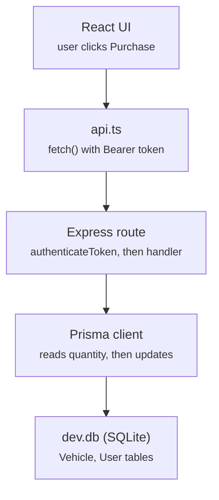
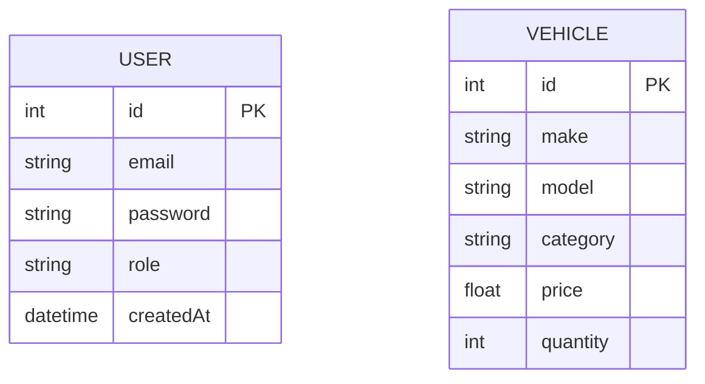

# Architecture

This doc follows one request end-to-end, then maps out where things live, the trust boundary, and known rough edges.

## Following a request: buying a vehicle



There's no separate controller or service layer in between: the Express route handler does the validation, the stock check, and the Prisma call itself, all in one function.

## Where each concern lives

| Concern | Lives in | Notes |
|---|---|---|
| Routing + business rules | `backend/src/routes/*.ts` | Validation, bcrypt, JWT, stock math — all inline. `controllers/` and `services/` exist but are empty, unused scaffolding |
| Auth | `backend/src/middleware/authMiddleware.ts` | `authenticateToken` verifies the JWT; `requireAdmin` gates admin-only routes |
| Persistence | `backend/src/lib/prisma.ts` + `backend/prisma/schema.prisma` | Prisma over `better-sqlite3`, two models: `User`, `Vehicle` |
| Client state | `frontend/src/hooks/useAuth.ts` | Token/role in `useState` only — nothing survives a page refresh |
| Client → API | `frontend/src/services/api.ts` | Thin `fetch` wrappers, one per endpoint, hardcoded `API_URL` |

## Data model



`User.role` is `user` or `admin`. `Vehicle` has no foreign key to `User` — purchases decrement `quantity` in place rather than recording who bought what.

## Trust boundary

Everything past `authenticateToken` assumes the JWT is valid and the `role` claim is trustworthy — it's signed server-side at login and never re-derived from the database mid-request. `requireAdmin` then narrows create, update, delete, and restock to admins, while read, search, and purchase stay open to any logged-in user.

One gap in that boundary: the JWT secret falls back to a hardcoded string if `JWT_SECRET` isn't set in `.env`. Set it explicitly in any real deployment.

## Testing

Backend integration tests (Jest + Supertest) cover auth, vehicle CRUD, admin-gated routes, and health:

```
backend/src/__tests__/
  authRoutes.test.ts
  vehicleRoutes.test.ts
  adminVehicleRoutes.test.ts
  health.test.ts
```

No frontend tests yet.

## Known rough edges

- **Purchase race condition** — purchase is read-then-write (`findUnique` → check → `update`), not a single atomic conditional update. Two near-simultaneous purchases on the last unit could both pass the check before either write lands.
- **No session persistence** — the frontend keeps `token`/`role` in component state only, so a page refresh always drops back to the login screen.
- **Dead scaffolding** — `controllers/` and `services/` are empty. Either peel the logic out of the routes into them, or remove them so the tree matches what's actually running.
- **Hardcoded JWT fallback** — `getJwtSecret()` returns `'secret-key'` if `JWT_SECRET` is unset, which is fine for local dev but should fail loudly in production instead.